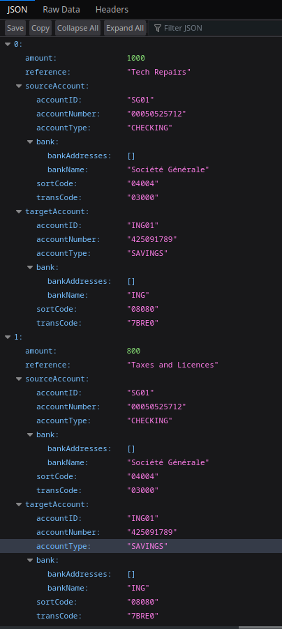
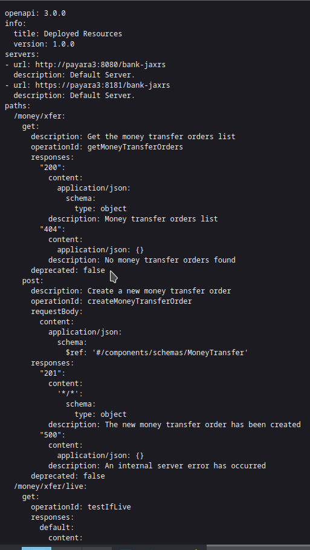

# Payara Hackathon

[

The application in this repository has been submitted to the Payara Hackathon that was conducted by the company from the
2nd to the 6th of March 2023.

Several business fields have been proposed by the organizers such that to be implemented by the submitted applications:

- a school management application
- a hospital management application
- a bank system application

This application implements a bank system and, since such a system may be very large and complex, only a small part of it
is represented here: a payment service based on a money transfer workflow.

> **_NOTA BENE:_**  This application, as implemented here, is far from being production ready. It's only a simple text 
> book case, developed in a couple of days and aiming at being presented to this contest, such that to highlight some of
> the most essential Jakarta EE 10 and Payara Platform features. Accordingly, the application lacks lots of enterprise 
> grade functionalities like security, optimizations, ergonomic and others.
> Also, while it tries to demonstrate the Jakarta EE API and their implementations by the Payara Platform, the application
> might do it in a strict "show-case" manner, without having sometimes a real business alignment and justification.
> 

## The Architecture
The application has a micro-services based architecture and, consequently, it consists in several micro-services, 
as follows:

- An initial data loading micro-service. This micro-service is responsible of loading money transfer orders.
- A data processing micro-service. This micro-service is reponsible of processing the money transfer orders.
- A money transfer micro-service. This micro-service is responsible of effectivelly performing the money transfer operations.

Each one of the three micro-services above is deployed on a separate instance of a Payara Platform cluster. The initial 
data loading and the processing ones are deployed on Payara Micro while the money transfer one is deployed on Payara Serever.

## The Infrastructure
The infrastructure required to get the application running consists in 3 Payara Platform instances, 2 Payara Micro 
and 1 Payara Server. All these instances are running as Docker images and, hence, the test environment shall dispose
of a running Docker daemon, together with the `docker-compose` binary.

An Apache ActiveMQ message broker is also part of this infrastructure. It runs in its separate Docker container as well.
Here I could use the OpenMQ message broker embedded in the Payara Server but, for the sake of some software architecture
principles like the loose coupling, I prefered to use a separate, stand-alone message broker and Apache ActiveMQ was my
best choice. Kafka could have been another scenario but given that it's more a streaming platform than a message broker,
I didn't consider it.

## The Initial Data Loading Micro-service
This micro-service is implemented as a Maven module named `bank-batch`. Its responsibility is to run a batch job which 
loads files containing money transfer orders, expressed in an XML based well defined grammar. 

### Description
The `bank-batch` micro-service consists in the following components:

- `MoneyTransferBatchStarter`: this component is a Jakarta EE singleton decorated with the `@Startup` annotation, such that it automatically starts once deployed. It uses Jakarta Batch API to start a job which name is passed as an Eclipse MP Config property.
- `MoneyTransferBatchlet`: this is the batchlet executed by our Jakarta Batch process. It uses JAXB such that to unmarshal the XML money transfer orders into Java objects. It is also a Jakarta Messaging client, in the sense that it opens a JMS connection to the ActiveMQ message broker and publishes on a well-defined queue the input data.

The choice of using Jakarta Batch for the initial data loading process has been motivated by the fact that, in general,
a bank system is handling huge data amounts and, hence, the batch processing pattern is the most suitable here. **This is 
also the reason why the application doesn't provide a GUI (*Graphical User Interface*).**

### Testing
While I didn't provide unit and integration tests for this micro-service, it's quite easy to test it, as shown below:

    $ git clone https://github.com/nicolasduminil/payara-hackathon.git
    $ cd payara-hackathon/bank
    $ mvn clean install
    $ docker logs payara1 --details --follow

Executing the commands above should display the Payara Micro log file and the following listing should appear:

     [2023-03-04T12:11:25.521+0000] [] [INFO] [] [PayaraMicro] [tid: _ThreadID=1 _ThreadName=main] [timeMillis: 1677931885521] [levelValue: 800] Payara Micro 6.2023.2 #badassmicrofish (build 903) ready in 15,245 (ms)
     [concurrent/__defaultManagedExecutorService-managedThreadFactory-Thread-10] INFO fr.simplex_software.payara_hackathon.bank.batch.MoneyTransferBatchlet - *** MoneyTransferBatchlet.process(): Have produced a money transfer order having refernce Tech Repairs
     [concurrent/__defaultManagedExecutorService-managedThreadFactory-Thread-10] INFO fr.simplex_software.payara_hackathon.bank.batch.MoneyTransferBatchlet - *** MoneyTransferBatchlet.process(): Have produced a money transfer order having refernce Taxes and Licences
     [concurrent/__defaultManagedExecutorService-managedThreadFactory-Thread-10] INFO fr.simplex_software.payara_hackathon.bank.batch.MoneyTransferBatchlet - *** MoneyTransferBatchlet.process(): Have produced a money transfer order having refernce Advertising
     [concurrent/__defaultManagedExecutorService-managedThreadFactory-Thread-10] INFO fr.simplex_software.payara_hackathon.bank.batch.MoneyTransferBatchlet - *** MoneyTransferBatchlet.process(): Have produced a money transfer order having refernce Meal and Entertainment
     [concurrent/__defaultManagedExecutorService-managedThreadFactory-Thread-10] INFO fr.simplex_software.payara_hackathon.bank.batch.MoneyTransferBatchlet - *** MoneyTransferBatchlet.process(): Have produced a money transfer order having refernce Other expanses

These messages confirm that the Jakarta Batch has been started and that the input file containing the money transfer 
order has been read and unmarshaled into Java objects that have been sent to the message broker.

### Implemntation Notes
The `bank-batch` micro-service is using the following Jakarta EE and Eclipse MP features:

- Jakarta Batch
- Jakarta Enterprise Beans
- Jakarta Messaging
- Eclipse Micrprofile Config
- Jakarta CDI
- Jakarta XML Binding

The choice of using the batch processing pattern was made, as explained, such that to satisfy the business requirements
of the financial world, gouverned by very high amount of data. In this context, trying to provide the same business 
value via a GUI wouldn't have been a suitable solution. As more as, in banks, the most prefered tool of financial
analysts is Microsoft Excel. Accordingly, thousands of Excel sheets are generally converted into XML such that to be used
as input data sources.

Several improvements are to be brought to this component, should it become real. One of the most important is a file poller
able to listen on a defined input directory for incomming XML files. For the simplicity, testability and readability sake,
I didn't implement this file poller in this prototype.

## The Data Processing Micro-service
This micro-service is reponsible of processing the money transfer orders. Its name is `bank-jms`.

### Description
The `bank-jms` micro-service consists in the following components:

- `MoneyTransferConsumer`: this Java class is a Jakarta singleton decorated with the `@Startup` annotation such that to automatically start upon deployment. It is, in the same time, a JMS client which is listening on the ActiveMQ message broker designated queue and, as soon as a message has landed, it is sent to the money transfer micro-service..
- `MoneyTransferRestClient`: this Java interface is the contract with the money transfer service. The implementation of this interface is automatically generated by Eclipse MP Rest Client.

This component implements the mediator design pattern, by being the man-in-the-middle in the communication process between
the initial data loading and the money transfer micro-services. It aims at realizing the loose coupling, which is our 
Graal here :-)

### Testing
To test the `bank-jms` micro-service, proceed as follows:

    $ git clone https://github.com/nicolasduminil/payara-hackathon.git
    $ cd payara-hackathon/bank
    $ mvn clean install
    $ docker logs payara2 --details --follow

Looking in the Payara Micro server on which the service is deployed, the following listing should appear:

    [ActiveMQ Session Task-2] INFO fr.simplex_software.payara_hackathon.bank.jms.MoneyTransferConsumer - *** MoneyTransferMessageListener.onMessage(): Have received a money transfer order with reference Tech Repairs
    [ActiveMQ Session Task-2] INFO fr.simplex_software.payara_hackathon.bank.jms.MoneyTransferConsumer - *** MoneyTransferMessageListener.onMessage(): Have created the money transfer order with reference Tech Repairs
    [ActiveMQ Session Task-2] INFO fr.simplex_software.payara_hackathon.bank.jms.MoneyTransferConsumer - *** MoneyTransferMessageListener.onMessage(): Have received a money transfer order with reference Taxes and Licences
    [ActiveMQ Session Task-2] INFO fr.simplex_software.payara_hackathon.bank.jms.MoneyTransferConsumer - *** MoneyTransferMessageListener.onMessage(): Have created the money transfer order with reference Taxes and Licences
    [ActiveMQ Session Task-2] INFO fr.simplex_software.payara_hackathon.bank.jms.MoneyTransferConsumer - *** MoneyTransferMessageListener.onMessage(): Have received a money transfer order with reference Advertising
    [ActiveMQ Session Task-2] INFO fr.simplex_software.payara_hackathon.bank.jms.MoneyTransferConsumer - *** MoneyTransferMessageListener.onMessage(): Have created the money transfer order with reference Advertising
    [ActiveMQ Session Task-2] INFO fr.simplex_software.payara_hackathon.bank.jms.MoneyTransferConsumer - *** MoneyTransferMessageListener.onMessage(): Have received a money transfer order with reference Meal and Entertainment
    [ActiveMQ Session Task-2] INFO fr.simplex_software.payara_hackathon.bank.jms.MoneyTransferConsumer - *** MoneyTransferMessageListener.onMessage(): Have created the money transfer order with reference Meal and Entertainment
    [ActiveMQ Session Task-2] INFO fr.simplex_software.payara_hackathon.bank.jms.MoneyTransferConsumer - *** MoneyTransferMessageListener.onMessage(): Have received a money transfer order with reference Other expanses
    [ActiveMQ Session Task-2] INFO fr.simplex_software.payara_hackathon.bank.jms.MoneyTransferConsumer - *** MoneyTransferMessageListener.onMessage(): Have created the money transfer order with reference Other expanses

This listing shows that the `MoneyTransferConsumer` Java class has received the money transfer orders, trasmitted by 
our Jakarta batch and, in its turn, has called the money transfer micro-service, via its Eclipse MP Rest Client.

### Implementation Notes
The `bank-jms` component it a stand-alone JMS client. While the JMS protocol is definetly a part of the Jakarta EE 
Messaging specifications, when used in a managed way, i.e. when run in a Jakarta EE container, this JMS client should be
implemented as an MDB (*Message Driven Bean*), rather than as a stand-alone JMS one.
But, in order to implement it as an MDB, I needed the ActiveMQ JCA (*Jakarta Connection Architecture*) resource adapter.
And in its current release, this JCA resource adapter doesn't support Jakarta EE 10. The Apache foundation will provide
soon an updated relase with support for jakarta EE 10, however, as per this writing, it is not yet available.

This micro-service is using the following Jakarta EE and Eclipse MP features:

- Jakarta Enterprise Beans
- Jakarta Messaging
- Eclipse Micrprofile Config
- Jakarta CDI
- Jakarta XML Binding
- Eclipse Microprofile Rest Client

## The Money Transfer Micro-service
This is a fictional micro-service, named `bank-jaxrs`, supposed to effectively perform the money transfer operations for our bank system.
It exposes a Jakarta RESTful API (*Application Program Interface*) and it simulates the money transfer operation by 
simply persisting the order in the database.

### Description
The `bank-jaxrs` micro-service is implemented as a Jakarta Persistence CRUD (*Create, Read, Update, Delete*) which exposes
a Jakarta RESTful API. The CRUD consists in 5 endpoints, as follows:

- a create endpoint
- an update endpoint
- a delete endpoint
- two get endpoints, one for all the registered money transfer orders, the other one for a single one, identified by its reference 

### Testing
To test the `bank-jms` micro-service, proceed as follows:

    $ git clone https://github.com/nicolasduminil/payara-hackathon.git
    $ cd payara-hackathon/bank
    $ mvn clean install

During the install phase of the Maven cycle, the following unit and integration tests are executed:

- `MoneyTransferFacadeIT`: this is an integration test of the `bank-facade` component
- `TestBankJaxb`: this is an unit test of the bank-jaxb component
- `MoneyTransferJaxRsIT`: this is an integration test of the `bank-jaxrs` component which uses the Jakarta REST Client
- `MoneyTransferRestAssuredIT`: this is an integration test of the `bank-jaxrs` component which uses the rest-assured library

Further to the execution of the commands above, the unit and integartion tests are displayed, for example:

    [INFO] -------------------------------------------------------
    [INFO]  T E S T S
    [INFO] -------------------------------------------------------
    [INFO] Running fr.simplex_software.payara_hackathon.bank.jaxb.tests.TestBankJaxb
    [INFO] Tests run: 2, Failures: 0, Errors: 0, Skipped: 0, Time elapsed: 0.21 s - in fr.simplex_software.payara_hackathon.bank.jaxb.tests.TestBankJaxb
    [INFO]
    [INFO] Results:
    [INFO]
    [INFO] Tests run: 2, Failures: 0, Errors: 0, Skipped: 0[INFO] Tests run: 5, Failures: 0, Errors: 0, Skipped: 0, Time elapsed: 19.739 s - in fr.simplex_software.payara_hackathon.bank.jaxrs.tests.MoneyTransferJaxRsIT
    ...
    [INFO] -------------------------------------------------------
    [INFO]  T E S T S
    [INFO] -------------------------------------------------------
    [INFO] Running fr.simplex_software.payara_hackathon.bank.jpa.tests.TestMoneyTransferEntity
    [INFO] Tests run: 4, Failures: 0, Errors: 0, Skipped: 0, Time elapsed: 0.661 s - in fr.simplex_software.payara_hackathon.bank.jpa.tests.TestMoneyTransferEntity
    [INFO]
    [INFO] Results:
    [INFO]
    [INFO] Tests run: 4, Failures: 0, Errors: 0, Skipped: 0
    [INFO]
    ...
    [INFO] -------------------------------------------------------
    [INFO]  T E S T S
    [INFO] -------------------------------------------------------
    [INFO] Running fr.simplex_software.payara_hackathon.bank.mapping.tests.TestBankMapper
    [INFO] Tests run: 2, Failures: 0, Errors: 0, Skipped: 0, Time elapsed: 0.066 s - in fr.simplex_software.payara_hackathon.bank.mapping.tests.TestBankMapper
    [INFO] Running fr.simplex_software.payara_hackathon.bank.mapping.tests.TestMoneyTransferMapper
    [INFO] Tests run: 2, Failures: 0, Errors: 0, Skipped: 0, Time elapsed: 0.006 s - in fr.simplex_software.payara_hackathon.bank.mapping.tests.TestMoneyTransferMapper
    [INFO] Running fr.simplex_software.payara_hackathon.bank.mapping.tests.TestBankAddressMapper
    [INFO] Tests run: 2, Failures: 0, Errors: 0, Skipped: 0, Time elapsed: 0.003 s - in fr.simplex_software.payara_hackathon.bank.mapping.tests.TestBankAddressMapper
    [INFO]
    [INFO] Results:
    [INFO]
    [INFO] Tests run: 6, Failures: 0, Errors: 0, Skipped: 0
    [INFO] 
    ...
    [INFO] -------------------------------------------------------
    [INFO]  T E S T S
    [INFO] -------------------------------------------------------
    [INFO] Running fr.simplex_software.payara_hackathon.bank.facade.tests.MoneyTransferFacadeIT
    [INFO] Tests run: 5, Failures: 0, Errors: 0, Skipped: 0, Time elapsed: 1.173 s - in fr.simplex_software.payara_hackathon.bank.facade.tests.MoneyTransferFacadeIT
    [INFO]
    [INFO] Results:
    [INFO]
    [INFO] Tests run: 5, Failures: 0, Errors: 0, Skipped: 0
    [INFO] 

Here we can see the 17 unit and integration tests have been ran successfuly. And in order to make sure
that everything went as expected, we can look also in the Payara Server log file to see that:

    $ docker logs payara3 --details --follow
     [#|2023-03-04T14:18:07.356+0000|INFO|Payara 6.2023.2||_ThreadID=99;_ThreadName=http-thread-pool::http-listener-1(5);_TimeMillis=1677939487356;_LevelValue=800;|
    *** MoneyTransferResource.createMoneyTransferOrder(): Have created money tansfer order with reference Tech Repairs|#]

    [#|2023-03-04T14:18:07.381+0000|INFO|Payara 6.2023.2||_ThreadID=95;_ThreadName=http-thread-pool::http-listener-1(1);_TimeMillis=1677939487381;_LevelValue=800;|
    *** MoneyTransferResource.createMoneyTransferOrder(): Have created money tansfer order with reference Taxes and Licences|#]

    [#|2023-03-04T14:18:07.395+0000|INFO|Payara 6.2023.2||_ThreadID=96;_ThreadName=http-thread-pool::http-listener-1(2);_TimeMillis=1677939487395;_LevelValue=800;|
    *** MoneyTransferResource.createMoneyTransferOrder(): Have created money tansfer order with reference Advertising|#]

    [#|2023-03-04T14:18:07.410+0000|INFO|Payara 6.2023.2||_ThreadID=97;_ThreadName=http-thread-pool::http-listener-1(3);_TimeMillis=1677939487410;_LevelValue=800;|
    *** MoneyTransferResource.createMoneyTransferOrder(): Have created money tansfer order with reference Meal and Entertainment|#]

    [#|2023-03-04T14:18:07.423+0000|INFO|Payara 6.2023.2||_ThreadID=98;_ThreadName=http-thread-pool::http-listener-1(4);_TimeMillis=1677939487423;_LevelValue=800;|
    *** MoneyTransferResource.createMoneyTransferOrder(): Have created money tansfer order with reference Other expanses|#]

This listing confirms that the money transfer orders have been created successfuly. And in order to make sure, one can fire the prefered browser at
http://192.168.9613:8080/bank-jaxrs/money/xfer to see this:

The liveness and healthyness endpoints may also be tested at http://192.168.96.13:8080/health/live and, respectivelly 
http://192.168.96.13:8080/health/ready. Or both may be tested at http://192.168.96.13:8080/health.

Last but not least, the open-api documentation is available at http://192.168.96.13:8080/open-api, as
shown below:

### Implementation Notes
The micro-service `bank-jaxrs` is purely fictive and it simply simulates the money transfer operations
by persisting them in the Payara Server H2 default database.

This micro-service uses the following Jakarta EE and Eclipse MP features:

- Jakarta RESTfull API
- Jakarta Persistence
- Jakarta Enterprise Beans
- Jakarta CDI
- Eclipse MP Configuration
- Eclipse MP Metrics
- Eclipse MP High Availability and Fault Tolerance
- Eclipse MP Health Checks
- Eclipse MP Open API

I've tried hard to implement the JWT based security for this micro-service but I didn't manage to
get it working. It seems that the Payara Platform has vendor specific conventions as far as the file
names containing the public key, issuer name and other required elements are concerned. These
vendor specific conventions aren't documented, at least I didn't find anything. And the quick-starts samples
don't help here as they don't provide any example.

## The `bank-infrastructure` Project
The infrastructure required by the application has been described above. It is created dynamically
by the build process. Nothing else than a running Docker daemon and the docker-compose binary is required
in order to get everything working.
The Maven module `bank-infrastructure` is a purely devops project which uses IaC (*Infrastructure as Code*)
technics in order to create the required runtime.

The following infrastructure elements are created:

- a bridged network named `bank-infra-cluster` with fixed IP addresses in the subnet 192.168.96.0/20
- a Payara Micro server having the IP address 192.168.96.11 and the hostname `payara1`. Here we deploy the `bank-batch` WAR.
- a Payara Micro server having the IP address 192.168.96.12 and the hostname `payara2`. Here we deploy the `bank-jms` WAR.
- a Payara Full server having the IP address 192.168.96.13 and the hostname `payara3`. here we deploy the `bank-jaxrs` WAR.
- an ActiveMQ message broker having the IP address 192.168.96.10 and the hostname `activemq`.

### Testing
In order to test the infrstructure, proceed as follows:

    $ git clone https://github.com/nicolasduminil/payara-hackathon.git
    $ cd payara-hackathon/bank
    $ mvn clean install

Once that the Maven install phase has been executed, the whole infrastructure should be up and running.
In order to check it do that:

    $ docker ps
    CONTAINER ID   IMAGE                               COMMAND                  CREATED             STATUS             PORTS                                                                                                                                                                                          NAMES
    8dc6238d7d05   payara/server-full:6.2023.2-jdk17   "/tini -- /bin/sh -c…"   About an hour ago   Up About an hour   8181/tcp, 0.0.0.0:34848->4848/tcp, :::34848->4848/tcp, 0.0.0.0:38080->8080/tcp, :::38080->8080/tcp, 0.0.0.0:38081->8081/tcp, :::38081->8081/tcp, 0.0.0.0:39009->9009/tcp, :::39009->9009/tcp   payara3
    ff3aec83ddaa   payara/micro:6.2023.2-jdk17         "/bin/sh entrypoint.…"   About an hour ago   Up About an hour   0.0.0.0:26900->6900/tcp, :::26900->6900/tcp, 0.0.0.0:28080->8080/tcp, :::28080->8080/tcp                                                                                                       payara2
    b424135d9eaf   payara/micro:6.2023.2-jdk17         "/bin/sh entrypoint.…"   About an hour ago   Up About an hour   0.0.0.0:16900->6900/tcp, :::16900->6900/tcp, 0.0.0.0:18080->8080/tcp, :::18080->8080/tcp                                                                                                       payara1
    f990259ecf3c   rmohr/activemq:5.15.9-alpine        "/bin/sh -c 'bin/act…"   About an hour ago   Up About an hour   1883/tcp, 5672/tcp, 0.0.0.0:8161->8161/tcp, :::8161->8161/tcp, 61613-61614/tcp, 0.0.0.0:61616->61616/tcp, :::61616->61616/tcp                                                                  activemq

As you can see, all the 4 Docker containers are running now. You can check their configuration using `docker inspect` commands,
you can see the log files using the `docker logs` one or even connect to them by using `docker exec` ones.

### Implementation Notes
I used here fixed IP addresses. This isn't mandatory and it goes somehow against the use of the containers which are ephemer
and which IP addreses are achanging. In a production-ready application this addresses wouldn't have been fixed but here, 
without a DNS (*Domain Name Service*) it was easier to do things in this way, such that to avoid te possible confusion of
the localhost multiple TCP ports mapping.

## Other Artifacts
Beside the micro-services, modules and components described above, some others are used transversally.
Here is the list:

- `bank-facade`: this iplements the facade design pattern and has two flavours: a Jakarta Enterprise Beans one and a CDI one.
- `bank-jpa`: this is the Jakarta Ppersistence layer
- `bank-mapping`: this component is responsible of mapping DTOs (*Data Transfer Objects*) like `Bank`, `BankAccount`, `BankAddress`, etc., to entities like `BankEntity`, `BankAccountEntity`, `BankAddressEntity`, etc. It uses the mapstruct library

## Conclusions
The present project has been developed on the purpose of being submitted to the Payara hackathon taking
place from the 2nd to the 6th of March 2023. It consists of a micro-services based application illustrating the 
business case of a fictional bank system.

While developing this application, I focused on the criteria that have been mentioned by the company in the "Official Rules" 
document (https://www.payara.fish/payara-hackathon-2023-rules/). These criteria are:

- Radical inovation.
- Easy to use
- Potential impact
- Use of Jakarta EE and Microprofile

So, I've tried to satisfy as many criteria as I could, and here is a summary.

### Inovation
While not being really radically inovant, the application uses an inovant way of loading the initial working data.
It consists in using the batch processing pattern implemented by Jakarta Batch, which is particularly useful when it comes to 
high data volumes. Jakarta Batch is seldomly used in show-case applications, prototypes, POCs and even production-ready applications.
In most of the cases, the use of GUI based solutions are prefered, even if they aren't suitable for banks and for any organizations
handling large amount of data. Hence the relatively inovant character of the solution.

Another innovant point is the mapping of the domain model classes to JPA entities. Most of the domain model classes are
directly mapped to JPA entities, with the exception of the `BankAddressEntity` one. The association between `BankEntity` 
and `BankAddressEntity` is of a special kind, called *aggregation*. It's a stronger form of composition where the lifecycle
of the `BankAddressEntity` is fully dependent of the lifecycle of the `BankEntity`. As a matter of fact, a bank address 
cannot exist in the absence of the associated bank. In general, this kind of association is represented by a One-To-Many
or a Many-To-One relationship and, then, this additional semantic is lost. Representing this association as an 
aggregation is also innovant as it's only supported by recent JPA releases.

### Easy to use
This criterium is more relevant for applications providing a GUI, which isn't the case of the present one. I have thought 
for long wether to provide or not such a GUI and, finally, I decided not to, for several reasons:

- As explained above, it's my convinction that a GUI isn't suitable for an application which handles large amount of data.
- I could provide one anyway, even if it is not suitable, however nowadays GUIs are mostly JavaScript or TypeScript based, which isn't at all relevant, as far as Jakarta EE is concenrned.
- I could have provided a Jakarta Faces UI, even if it's neither suitable for handling large amount of data nore so much in fashion. I even considered this scenario until the end, but I've finally run out of time, trying in vain to get the JWT support running.

But even without a GUI, I think that the easiness of use might be a criterium which makes sense here. As a matter of fact,
the presented application is really easy to use, even if it lacks a GUI. Just drop a file in a given directory and 
that's it ! That's true that this file needs to have a particular syntax, based on an XML grammar, which is probably more
difficult to produce *ex nihilo*. But let's not forget that the potential users of such an application are financial 
analysts specialized in using Excel sheets, which are automatically converted in XML.

### Impact
A certain impact is expected from a Jakarta EE application based on a full micro-services architecture. Instead of being a 
monolith, like most of the classical Jakarta EE architectures are, the presented application is articulated around three 
micro-services, each one deployed on a separate node in a cluster.

The way that the integartion tests are conducted here is expected to have some impact as well. I'm using `testcontainers`
instead of Arquillian, and this allow me to fully rely on the flexibility given by the Docker images/containers. But even 
more impactfull is the way that the integration tests are executed outside the container, in a Java SE environment. Using
Weld-SE, the CDI implementation for Java SE, I can perform complex integration tests, using CDI to inject instances and 
trigger evennts, without the need of running containers with Arquillian or `testcontainers`.

### Use of Jakarta EE and Microprofile
The application uses all the Eclipse Microprofile features, from Configuration to RESTfull Client,
passing through Metrics, High Availability, Open API and Health Checks. It doesn't use the JWT propagation, even if it 
was planned to do it. I'm using the JWT Propagation on current basis with runtimes like Wildfly, Quarkus or OpenLiberty,
but with Payara Server I was unable to get things running.

The application uses also many Jakarta EE feature, like RESTfull API, Persistence, Batch, Enterprise Beans, CDI, Messaging,
XML Binding, JSON Binding, JSON Processing, and others.